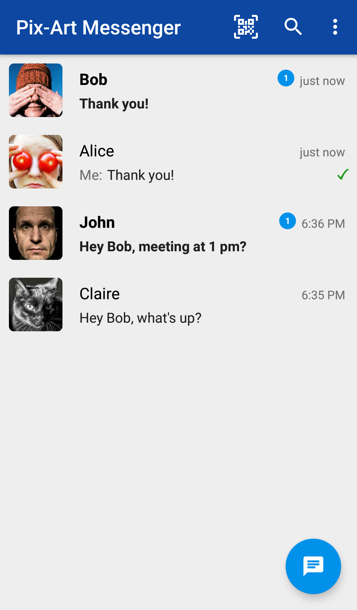
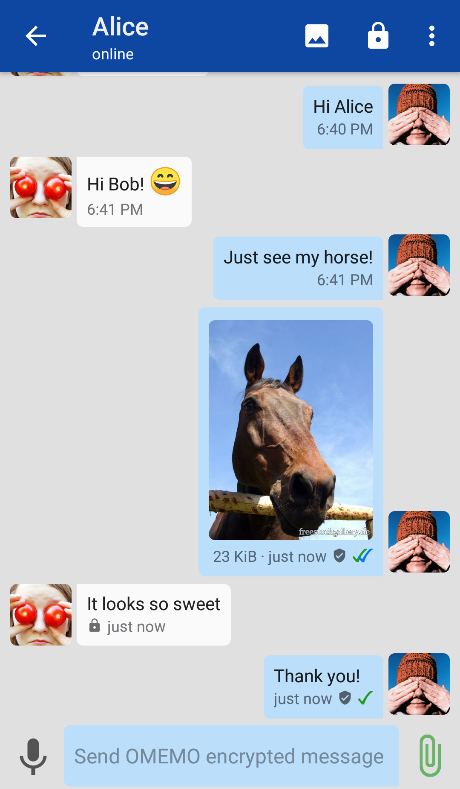
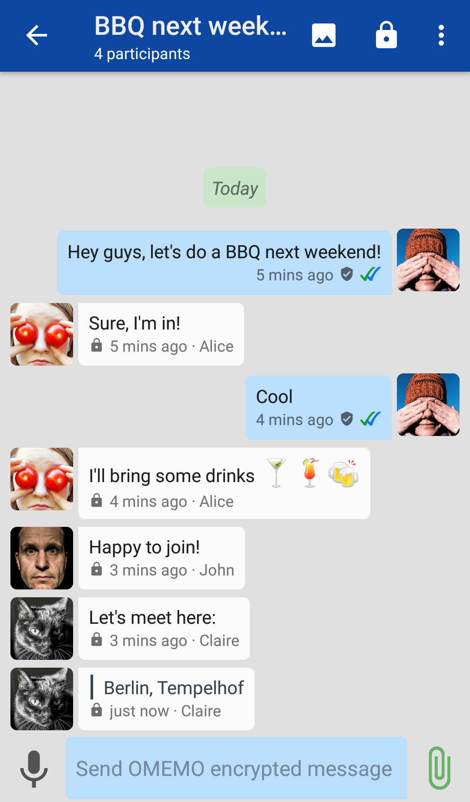
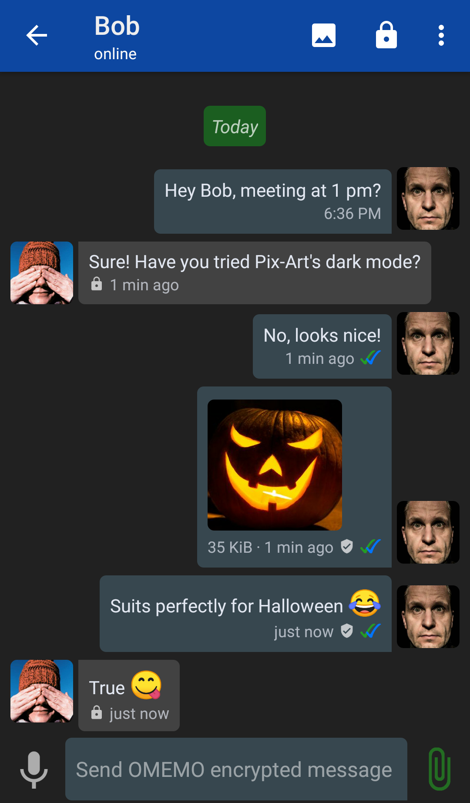
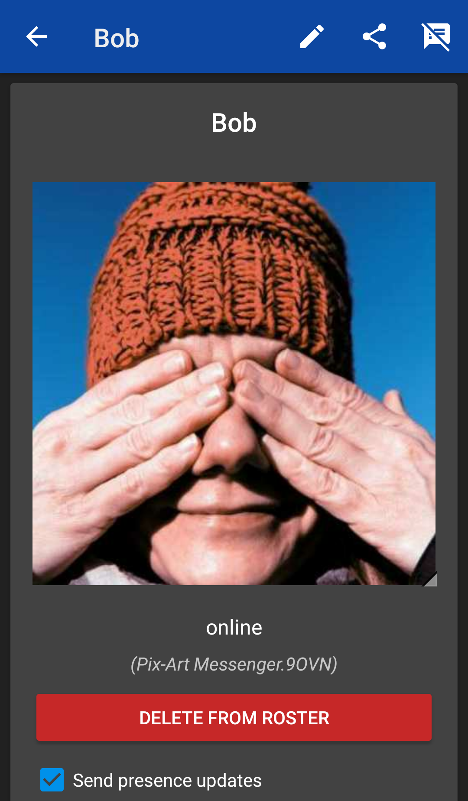

 
# Pix-Art Messenger [](https://circleci.com/gh/kriztan/Pix-Art-Messenger/tree/master)

🇩🇪 <a href='README.md' style="font-size:150%">Deutsche Version der Readme hier verfügbar.</a>

Pix-Art Messenger is a fork of [Conversations](https://github.com/siacs/Conversations).
The changes aim to improve usability and ease transition from pre-installed and other widespread messengers. Here are some screenshots:

      

(Images used were taken from http://freestockgallery.de)

## Download
Pix-Art is available for install in the F-Droid and Google-Play stores.
Alternatively release and beta-release APKs are available via github: [Releases](https://github.com/kriztan/Pix-Art-Messenger/releases/latest) 

<a href='https://play.google.com/store/apps/details?id=de.pixart.messenger'></a> <a href="https://f-droid.org/app/de.pixart.messenger"></a>

#### Pix-Art-Messenger nightly and beta

##### F-Droid
Scan the QR-Code below and add it to your F-Droid repositories.


#### Google Play
Google-Users can join the Google-Play beta program:
[Pix-Art Messenger beta](https://play.google.com/apps/testing/de.pixart.messenger)


## Social Media
<a rel="me" href="https://social.tchncs.de/@pixart">Pix-Art Messenger on Mastodon (German)</a>

There are also English and German speaking XMPP-MUCs focusing on support and development of the Pix-Art Messenger.

If you are interested in the development of the messenger, here is a MUC for you (English and German speaking):

Development-Chat:  [development@room.pix-art.de](https://jabber.pix-art.de/j/development@room.pix-art.de?join)     
[](https://jabber.pix-art.de/j/development@room.pix-art.de?join)


There also is an Support-MUC where you can ask questions and get help with issues you may encounter, see further below for details.


## How can I support translations ?
[](https://crowdin.com/project/pix-art-messenger)

Translation of in-app text is organised via [crowdin.com](https://crowdin.com/project/pix-art-messenger). You can add new languages as locales and add and edit translations already existing.

[Here is the project page on crowdin.com](https://crowdin.com/project/pix-art-messenger/invite?d=75l6j4k6k6k523f4j4m4e473u663d3m4p4t4q4)

## Help! I've encountered issues!
The easiest way to get some help is to join our support-MUC (both English and German).  

Support-Chat invite link: [support@room.pix-art.de](https://jabber.pix-art.de/j/support@room.pix-art.de?join)     
[](https://jabber.pix-art.de/j/support@room.pix-art.de?join)

Or scan this QR-Code:


If we can't fix your problem there, you can open an issue here on github, detailing your problem, how to reproduce it and provide logs. See instructions below on how to create log files.


### How to create debug logs? (adb)

#### GNU/Linux, OSX and other Unix-like systems:

1. First install The **A**ndroid **D**ebugging **B**ridge, if not already present.
    ###### Ubuntu / Linux Mint
    ```
    sudo apt-get update
    sudo apt-get install android-tools-adb
    ```
    ###### openSUSE 42.2 and 42.3
    ```
    sudo zypper ref
    sudo zypper install android-tools
    ```
    ###### openSUSE Tumbleweed
    here you need to add the following repo (e.g. via Yast):
    http://download.opensuse.org/repositories/hardware/openSUSE_Tumbleweed/
    
    alternatively you have the option to use the `1 Click installer` 
    https://software.opensuse.org/package/android-tools
    ###### other systems
    install adb using a method appropriate for your system 
    
2. Now open a terminal in a directory of you're choice, or navigate to the directory using `cd`.

3. Follow steps [6] to [10] of the Windows instructions.

4. Start outputting your log to a file on your computer. We will be using `logcat.txt`. Enter:
    ```
    $ adb -d logcat -v time | grep -i Pix-Art > logcat.txt
    ```

5. Follow the remaining steps [12] and [13] of the Windows instructions.


#### Windows:

1. Download Google's SDK-platform tools for your operating system:
    
    https://developer.android.com/studio/releases/platform-tools.html    
2. In case they were not included: You also need the ADB_drivers for your version of Microsoft Windows:
    
    https://developer.android.com/studio/run/win-usb.html
3. Extract the zip-archive (e.g. to `C:\ADB\`)
4. Open the command line (CMD) using the start menu:  Start > Execute: cmd
5. Navigate to the directory you extracted the zip to as following. We will be using `C:\ADB\`
    ```
    c:
    cd ADB
    ``` 
6. On your smartphone open the settings and search for the item `Developer Options`. If this option is not already present on your phone you will need to unlock it beforehand. To do this navigate to `Settings > About phone`, there locate `Build number` (or similar) and tap it 7-times in succession. You should now see a notification, that you are now a developer. Congrats, `Developer Options` are now available in your settings menu.
7. Inside `Developer Options` search activate the setting `USB-Debugging` (sometimes just called `Android Debugging`).
8. Connect your phone to your computer via USB cable. The necessary drivers should now be downloaded and installed if not already present. On Windows all necessary drivers should be downloaded automatically if you followed step [2] beforehand. On most GNU/Linux systems no additional action is required. 
9. If everything worked out, you can now return to the command line and test if your device is being recognised. Enter `adb devices -l`; you should see output similar to:
    ```
    > adb devices -l
    List of devices attached
    * daemon not running. starting it now on port 5037 *
    * daemon started successfully *
    042111560169500303f4   unauthorized
    ```
10. If your devices is labelled as `unautorized`, you must first accept a prompt on your phone asking if debugging over USB should be allowed. When rerunning `adb devices` you should now see:
    ```
    > adb devices
    List of devices attached 
    042111560169500303f4    device
    ```   
11. Start outputting your log to a file on your computer. We will be using `logcat.txt` in `C:\ADB\`. Just enter the following (without `> ` into the command line):
    ```
    > adb -d logcat -v time | FINDSTR Pix-Art > logcat.txt
    ``` 
12. Now reproduce the issue encountered.

13. Stop logging. Now take a close look at your log file and remove any personal and private information you may find before sending it together with a detailed description of your issue, instructions on how to reproduce to me. You can use GitHub's issue tracker: [Issues](https://github.com/kriztan/Pix-Art-Messenger/issues)
